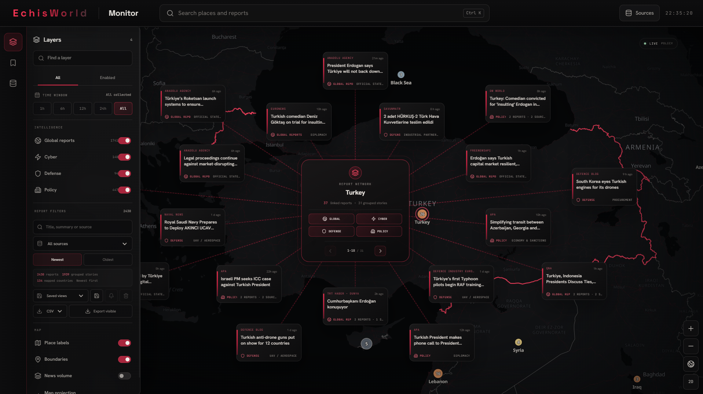

# EchisWorld

EchisWorld is a local-first public-source monitoring workspace. It collects reporting from configured sources, preserves the source context in PostgreSQL, and turns geographic activity into an interactive map and country-level report networks.

> **Status:** `0.1.0` MVP. EchisWorld displays source-reported information, not independently verified incidents. Availability, coverage, and freshness depend on upstream publishers and providers.



## What it provides

### Monitor

- A persistent OpenStreetMap-based MapLibre workspace with globe and 2D projections
- Four synchronized intelligence layers: **Global**, **Cyber**, **Defense**, and **Policy**
- Country-focused report networks with category filtering and shared pagination
- `1h`, `6h`, `12h`, `24h`, and **All** time windows; **All** includes every record currently retained by the local backend
- Report filtering by title, summary, source, country, category, and publication order
- Conservative grouping of related reports without presenting groups as verified events
- Original article text retrieval when a publisher exposes readable content, with the collected feed excerpt as an immediate fallback
- Saved monitor views, optional browser notifications, bookmarks, and CSV, JSON, or GeoJSON export
- A news-volume density overlay, country boundaries, place labels, and keyboard search with `Ctrl+K`

### Sources

- A canonical built-in source catalog collected by a server-side worker
- Optional provider integrations whose credentials stay outside the browser
- Installation-local HTTPS RSS, Atom, and public JSON connections managed from the Sources screen
- Source validation before collection, adaptive polling, conditional requests, backoff, and visible health states
- Explicit `fresh`, `partial`, `stale`, and `unavailable` states instead of generated demo activity

## How it works

```text
Public sources
      ↓
Collector worker → PostgreSQL → derived feed payloads
                                      ↓
                             Next.js API and Monitor
```

| Area | Implementation |
| --- | --- |
| Web application | Next.js 16, React 19, TypeScript |
| Geographic rendering | MapLibre GL JS with OpenStreetMap-derived OpenFreeMap tiles |
| Collection | Node.js worker with RSS, Atom, public JSON, and provider adapters |
| Analysis | Server-side global, cyber, defense, and policy payload builders |
| Storage | PostgreSQL with versioned SQL migrations |
| Local runtime | Docker Desktop and Docker Compose |

The Monitor remains mounted while navigating to Sources or Bookmarks, so returning to it does not recreate the map. Provider credentials are read only by the worker or server. They are never included in browser payloads.

## Quick start

### Requirements

- Node.js 24 or newer
- npm
- Docker Desktop using Linux containers and Docker Compose 2.24 or newer
- Internet access for public sources and map tiles

Clone and prepare the project:

```powershell
git clone https://github.com/4ilteris7/EchisWorld.git
cd EchisWorld
npm.cmd ci
npm.cmd run local:open
```

`local:open` performs the local setup, starts Docker Desktop on Windows when necessary, builds missing application images, applies database migrations, starts the collector and web application, waits for health checks, and opens EchisWorld in the default browser.

The first build and first collection take longer than subsequent starts. Source data appears as the collector completes its initial passes.

After `npm.cmd ci`, Windows users can also start the project by double-clicking `Start-EchisWorld.cmd`.

## Environment configuration

No private environment file is required for the base local stack. The launcher creates an ignored `.env.echis-local` file containing installation-specific database passwords and loopback ports. These values are generated locally and are never printed.

Optional provider integrations can be enabled by copying the safe template and adding only credentials owned by the current user:

```powershell
Copy-Item .env.example .env.local
```

Both `.env.local` and `.env.echis-local` are ignored. Never commit them, share them, include them in screenshots, or reuse the generated database configuration with a different existing data volume. Providers without credentials remain visibly unavailable; EchisWorld does not replace their results with sample records.

Keyless RSS, Atom, supported public JSON sources, and compatible public adapters can still operate without optional provider credentials. Additional RSS, Atom, or public JSON endpoints can be connected from the Sources screen; those connections are stored only in the installation's PostgreSQL database.

## Running locally

| Command | Purpose |
| --- | --- |
| `npm.cmd run local:open` | Start the complete local stack and open the browser |
| `npm.cmd run local:start` | Start the complete local stack without opening the browser |
| `npm.cmd run local:status` | Display containers and application health |
| `npm.cmd run local:stop` | Stop services while preserving local data |
| `npm.cmd run local:rebuild` | Rebuild application images after source changes |
| `npm.cmd run local:backup` | Create a checksummed PostgreSQL backup |
| `npm.cmd run local:restore -- <dump>` | Restore a verified dump into an empty local database |
| `npm.cmd run local:geo` | Load the separately generated detailed boundary dataset |

Application data is stored in the independent `echis-local_data` Docker volume. Normal stop and start operations preserve it.

## Development

For the fastest edit-and-refresh workflow:

```powershell
npm.cmd run dev
```

Development mode keeps PostgreSQL in Docker and runs migrations, the collector worker, and the Next.js Turbopack server on the host. Pressing `Ctrl+C` stops the host processes but leaves PostgreSQL ready for the next start.

If a dependency is incompatible with Turbopack, use:

```powershell
npm.cmd run dev:webpack
```

Run the project checks before submitting a change:

```powershell
npm.cmd run lint
npm.cmd run typecheck
npm.cmd test
npm.cmd run build
```

Database integration tests require `ECHIS_TEST_DATABASE_URL` to point to a disposable test database. Those tests can reset their target and must never use the application database or a production database. They are skipped when the variable is absent.

## Data and trust model

- Reports retain their source, URL, publication time, extraction basis, and available provenance fields.
- Grouped stories indicate textual and contextual similarity; they are not confirmation of an event.
- Full publisher text is requested only when a report is opened. JavaScript-only pages, bot protection, paywalls, or publisher restrictions may prevent extraction.
- Saved views and bookmarks remain local to the browser. Personal source connections remain local to the installation database.
- External services can be delayed, incomplete, unavailable, rate-limited, or incorrect.
- EchisWorld is an analytical interface for public reporting and must not be treated as authoritative operational intelligence.

## Repository structure

| Path | Responsibility |
| --- | --- |
| `app/` | Next.js application and server API routes |
| `components/monitor/` | Map, report network, filters, exports, and Monitor interactions |
| `components/sources/` | Built-in and installation-local source management |
| `lib/backend/` | Collection, storage, payloads, validation, and server safeguards |
| `lib/cyber/`, `lib/defense/`, `lib/policy/` | Domain-specific signal analysis |
| `worker/` | Background collection process |
| `db/migrations/` | Versioned PostgreSQL schema |
| `infra/` | Docker and reverse-proxy configuration |
| `scripts/` | Local lifecycle, database, geographic-data, and build utilities |

Large optional administrative-boundary data, database dumps, build output, local configuration, and generated MapLibre worker assets are deliberately excluded from Git. The repository contains the code and committed assets required for the standard Monitor; optional large datasets are rebuilt or loaded through the documented scripts.

## Security

Local services bind to loopback by default. Source mutations are restricted to the local application, remote content passes through bounded server-side fetching, and provider credentials remain server-side.

Do not open public issues containing credentials, database dumps, private infrastructure details, personal information, or sensitive coordinates. See [SECURITY.md](SECURITY.md) for responsible disclosure.

## Contributing

See [CONTRIBUTING.md](CONTRIBUTING.md) for setup, validation, and data-handling expectations.

## License and attribution

EchisWorld is licensed under the [Apache License 2.0](LICENSE). Third-party data, services, and bundled material remain subject to their own terms. See [THIRD_PARTY_NOTICES.md](THIRD_PARTY_NOTICES.md) for map and dataset attribution.
